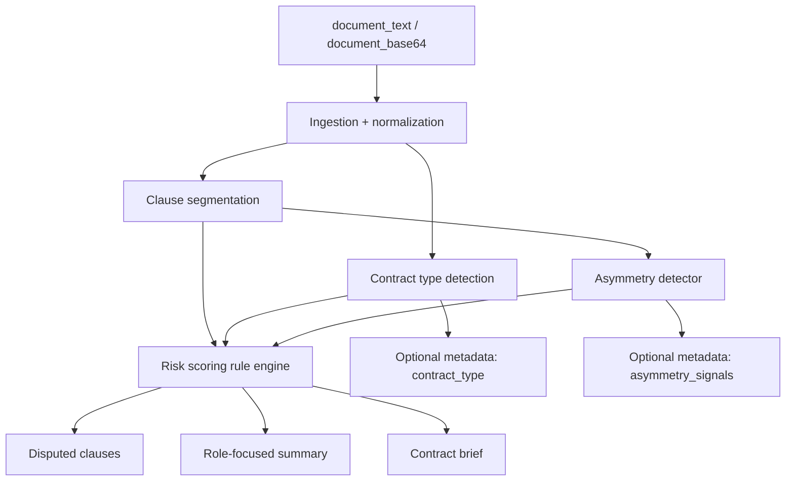

# Contract Risk Scanner: Analysis Architecture v2

## What changed

- added `ContractTypeDetector`
- added `AsymmetryDetector`
- replaced simple risk tags with a legal risk taxonomy
- moved severity decisions to role-aware escalation
- removed raw text truncation in favor of sentence-safe previews

## What did not change

- FastAPI surface remains compatible
- main output objects still include `risks`, `disputed_clauses`, `role_focused_summary`, `contract_brief`
- the engine is still config-first and does not depend on an external LLM
